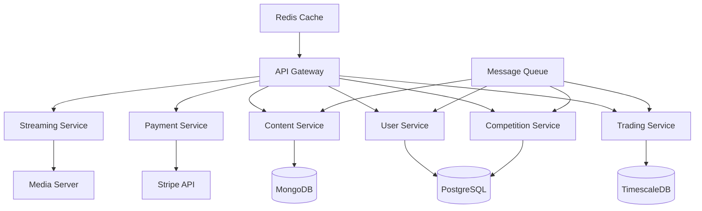
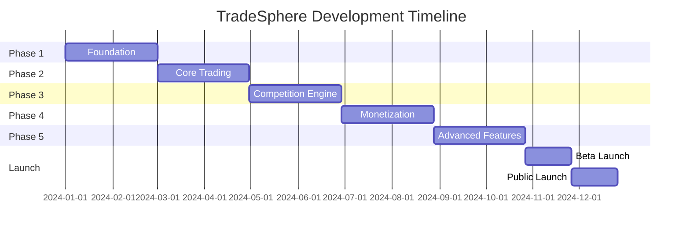

# TradoSphere Platform Development Plan
*Version 1.0 | MIT-Level Engineering Documentation*

## 1. Project Overview

### 1.1 Vision Statement
Create the premier social trading platform that democratizes financial education through human-validated mentorship, competitive trading, and creator empowerment.

### 1.2 Core Value Propositions
- **For Traders**: Free access to quality trading content, signals, and community
- **For Creators**: Sustainable monetization through subscriptions and mentorship
- **For Learners**: Validated education from proven traders with transparent track records

### 1.3 Success Metrics
- Monthly Active Users (MAU)
- Creator Retention Rate (>80% after 6 months)
- Subscriber Lifetime Value (LTV)
- Signal Accuracy Rate
- Platform Revenue Growth
- User Engagement Score

## 2. Technical Architecture

### 2.1 Technology Stack

#### Frontend
```yaml
Mobile:
  - Framework: Flutter 3.x
  - State Management: Riverpod 2.0
  - Real-time: WebSocket (socket.io-client)
  - Charts: fl_chart / trading_view_flutter
  - Video Streaming: Agora SDK / WebRTC
  
Web:
  - Framework: Next.js 14 (App Router)
  - UI Library: React 18
  - Styling: Tailwind CSS + Shadcn/ui
  - State: Zustand + React Query
  - Charts: TradingView Charting Library
  - Real-time: Socket.io
```

#### Backend
```yaml
Core Services:
  - Runtime: Node.js 20 LTS
  - Framework: NestJS (microservices)
  - Database: PostgreSQL 15 (primary)
  - Cache: Redis 7
  - Message Queue: RabbitMQ
  - Search: Elasticsearch
  
Specialized Services:
  - Live Streaming: MediaSoup / Agora.io
  - Real-time Data: WebSocket Server
  - Market Data: Alpha Vantage / Polygon.io API
  - Payment Processing: Stripe Connect
```

#### Infrastructure
```yaml
Cloud Provider: AWS / GCP
CDN: CloudFlare
Container: Docker + Kubernetes
CI/CD: GitHub Actions
Monitoring: Prometheus + Grafana
Logging: ELK Stack
```

### 2.2 Microservices Architecture



## 3. Feature Specifications

### 3.1 Core Features Matrix

| Feature | Priority | Sprint | Technical Complexity |
|---------|----------|--------|---------------------|
| User Authentication | P0 | 1-2 | Medium |
| Profile Management | P0 | 2-3 | Low |
| Signal Posting | P0 | 3-4 | Medium |
| Chart Sharing | P0 | 4-5 | High |
| Follow/Subscribe System | P0 | 5-6 | Medium |
| Live Streaming | P1 | 7-9 | Very High |
| Trading Competition | P0 | 10-12 | Very High |
| Creator Hub | P0 | 13-14 | High |
| Payment System | P0 | 15-16 | High |
| Trading Bootcamp | P1 | 17-18 | Medium |
| Analytics Dashboard | P1 | 19-20 | Medium |

### 3.2 Trading Competition System

#### Architecture Design
```typescript
interface CompetitionConfig {
  id: string;
  name: string;
  type: 'DEMO' | 'LIVE' | 'PAPER';
  duration: Duration;
  entryFee: number;
  prizePool: PrizeStructure;
  rules: CompetitionRules;
  scoringMetrics: ScoringMetrics;
}

interface ScoringMetrics {
  profitWeight: number;      // 40%
  riskAdjustedReturn: number; // 30%
  consistency: number;         // 20%
  drawdown: number;           // 10%
}

class CompetitionEngine {
  validateTrade(trade: Trade): ValidationResult
  calculateScore(portfolio: Portfolio): Score
  updateLeaderboard(userId: string, score: Score): void
  distributeRewards(winners: Winner[]): Promise<void>
}
```

### 3.3 Creator Monetization System

#### Revenue Model
```yaml
Creator Tiers:
  Free Trader:
    - View content
    - Follow traders
    - Join competitions
    - Limited signals/day
  
  Creator ($30/month):
    - Unlimited signal posting
    - Live streaming access
    - Bootcamp hosting
    - Subscriber management
    - Analytics dashboard
    
  Subscriber Pricing:
    - Set by creator: $10-500/month
    - Platform fee: 10% of subscription
    - Payout: Weekly via Stripe
```

### 3.4 Human Validation System

```typescript
interface ValidationFramework {
  trackRecord: {
    minimumTrades: 100;
    minimumDuration: '6 months';
    profitability: 'positive';
    verification: 'broker_api' | 'manual_review';
  };
  
  communityRating: {
    signalAccuracy: number;  // 0-100%
    educationalValue: number; // 1-5 stars
    responseTime: number;     // avg hours
    studentSuccess: number;   // % profitable
  };
  
  badges: Badge[];
  certifications: Certification[];
}
```

## 4. Development Methodology

### 4.1 SCRUM Implementation

#### Team Structure
```yaml
Scrum Teams (7±2 members each):
  Team Alpha - Core Platform:
    - 2 Flutter Developers
    - 2 Backend Engineers
    - 1 DevOps Engineer
    - 1 QA Engineer
    - 1 Product Owner
    
  Team Beta - Trading Features:
    - 2 Full-Stack Engineers
    - 1 Data Engineer
    - 1 Financial Systems Expert
    - 1 QA Engineer
    - 1 Scrum Master
    
  Team Gamma - Creator Tools:
    - 2 React Developers
    - 2 Backend Engineers
    - 1 UI/UX Designer
    - 1 QA Engineer
```

#### Sprint Planning
```markdown
Sprint Duration: 2 weeks
Ceremonies:
  - Sprint Planning: 4 hours
  - Daily Standup: 15 minutes
  - Sprint Review: 2 hours
  - Retrospective: 1.5 hours
  
Velocity Target: 40-50 story points/sprint/team
```

### 4.2 Development Phases

#### Phase 1: Foundation (Months 1-2)
- [ ] Project setup and infrastructure
- [ ] Authentication system
- [ ] Basic user profiles
- [ ] Database schema design
- [ ] API architecture
- [ ] CI/CD pipeline

#### Phase 2: Core Trading (Months 3-4)
- [ ] Signal posting system
- [ ] Chart integration
- [ ] Follow/subscriber mechanism
- [ ] Basic feed algorithm
- [ ] Push notifications

#### Phase 3: Competition Engine (Months 5-6)
- [ ] Competition framework
- [ ] Leaderboard system
- [ ] Scoring algorithm
- [ ] Paper trading integration
- [ ] Prize distribution

#### Phase 4: Monetization (Months 7-8)
- [ ] Stripe Connect integration
- [ ] Subscription management
- [ ] Creator dashboard
- [ ] Payout system
- [ ] Revenue analytics

#### Phase 5: Advanced Features (Months 9-10)
- [ ] Live streaming
- [ ] Trading bootcamp
- [ ] Advanced analytics
- [ ] AI-powered insights
- [ ] Social features enhancement

## 5. UI/UX Design System

### 5.1 Design Principles
```yaml
Core Principles:
  - Data Density: Maximum information, minimal clutter
  - Real-time Focus: Sub-second updates for critical data
  - Mobile-First: Optimized for one-handed operation
  - Dark Mode Default: Reduce eye strain for traders
  - Accessibility: WCAG 2.1 AA compliance
```

### 5.2 Component Library

```typescript
// Shared Design Tokens
const designTokens = {
  colors: {
    profit: '#00D97E',
    loss: '#FF3B30',
    primary: '#007AFF',
    background: {
      dark: '#0A0E27',
      darker: '#060818',
    },
  },
  spacing: {
    unit: 8,
    grid: 'units of 8px',
  },
  typography: {
    heading: 'Inter',
    body: 'Inter',
    mono: 'JetBrains Mono', // for prices
  },
};
```

### 5.3 Key Screens

```yaml
Mobile Screens (Flutter):
  1. Onboarding Flow:
     - Welcome
     - Trading Experience Survey
     - Interest Selection
     - Creator Discovery
  
  2. Main Navigation:
     - Feed (Home)
     - Discover
     - Competitions
     - Portfolio
     - Profile
  
  3. Creator Hub:
     - Dashboard
     - Stream Setup
     - Signal Composer
     - Analytics
     - Earnings
  
  4. Trading Screens:
     - Live Chart View
     - Signal Details
     - Trade Execution
     - Position Manager
```

## 6. Security & Compliance

### 6.1 Security Architecture

```yaml
Security Layers:
  Authentication:
    - OAuth 2.0 + JWT
    - 2FA mandatory for creators
    - Biometric login (mobile)
  
  API Security:
    - Rate limiting
    - API key management
    - Request signing
    - DDoS protection
  
  Data Security:
    - AES-256 encryption at rest
    - TLS 1.3 in transit
    - PII tokenization
    - Secure key management (AWS KMS)
  
  Financial Security:
    - PCI DSS compliance
    - Fraud detection
    - Transaction monitoring
    - Secure webhook handling
```

### 6.2 Regulatory Compliance

```markdown
Required Compliance:
- GDPR (Europe)
- CCPA (California)
- FinCEN regulations
- Anti-money laundering (AML)
- Know Your Customer (KYC) for creators
- Investment advice disclaimers
```

## 7. Testing Strategy

### 7.1 Test Coverage Requirements

```yaml
Coverage Targets:
  Unit Tests: 80%
  Integration Tests: 70%
  E2E Tests: Critical paths
  Performance Tests: All APIs
  Security Tests: Quarterly pentests
```

### 7.2 Testing Framework

```typescript
// Flutter Testing
testWidgets('Signal card displays correctly', (tester) async {
  await tester.pumpWidget(
    SignalCard(
      signal: mockSignal,
      onTap: () {},
    ),
  );
  
  expect(find.text('BUY'), findsOneWidget);
  expect(find.byType(PriceChart), findsOneWidget);
});

// Backend Testing (Jest)
describe('CompetitionService', () => {
  it('should calculate scores correctly', async () => {
    const result = await service.calculateScore(mockPortfolio);
    expect(result.totalScore).toBeCloseTo(87.5, 1);
  });
});
```

## 8. Deployment & DevOps

### 8.1 CI/CD Pipeline

```yaml
Pipeline Stages:
  1. Code Commit:
     - Linting (ESLint, Dart analyzer)
     - Security scan (Snyk)
     - Unit tests
  
  2. Build:
     - Docker image creation
     - Version tagging
     - Artifact storage
  
  3. Test:
     - Integration tests
     - E2E tests
     - Performance tests
  
  4. Deploy:
     - Staging (automatic)
     - Production (manual approval)
     - Rollback capability
  
  5. Monitor:
     - Health checks
     - Performance metrics
     - Error tracking (Sentry)
```

### 8.2 Infrastructure as Code

```terraform
# Example Terraform for AWS
resource "aws_eks_cluster" "tradesphere" {
  name     = "tradesphere-cluster"
  role_arn = aws_iam_role.eks.arn

  vpc_config {
    subnet_ids = aws_subnet.private[*].id
  }
}

resource "aws_rds_cluster" "postgresql" {
  cluster_identifier      = "tradesphere-db"
  engine                  = "aurora-postgresql"
  engine_version          = "15.2"
  database_name           = "tradesphere"
  master_username         = "admin"
  master_password         = var.db_password
  backup_retention_period = 7
  preferred_backup_window = "07:00-09:00"
}
```

## 9. Scalability Strategy

### 9.1 Performance Targets

```yaml
SLAs:
  API Response Time: p95 < 200ms
  Uptime: 99.9%
  Concurrent Users: 100,000
  Transactions/sec: 10,000
  Stream Latency: < 3 seconds
```

### 9.2 Scaling Architecture

```markdown
Horizontal Scaling:
- Kubernetes auto-scaling (HPA)
- Database read replicas
- CDN for static assets
- Microservices isolation

Vertical Scaling:
- Resource monitoring
- Capacity planning
- Load testing benchmarks
```

## 10. Risk Analysis & Mitigation

### 10.1 Technical Risks

| Risk | Impact | Probability | Mitigation |
|------|--------|-------------|------------|
| Scalability issues | High | Medium | Load testing, auto-scaling |
| Security breach | Critical | Low | Security audits, encryption |
| Market data delays | High | Medium | Multiple data providers |
| Payment failures | High | Low | Retry logic, multiple gateways |

### 10.2 Business Risks

| Risk | Impact | Probability | Mitigation |
|------|--------|-------------|------------|
| Low creator adoption | Critical | Medium | Incentive program, marketing |
| Regulatory changes | High | Medium | Legal compliance team |
| Competition from established platforms | High | High | Unique features, better UX |
| Fraudulent signals | High | Medium | Validation system, reporting |

## 11. Development Timeline

### 11.1 Milestone Schedule



### 11.2 Resource Allocation

```yaml
Team Size by Phase:
  Phase 1: 8 developers
  Phase 2: 12 developers
  Phase 3: 15 developers
  Phase 4: 15 developers
  Phase 5: 20 developers
  
Budget Allocation:
  Development: 60%
  Infrastructure: 20%
  Marketing: 10%
  Legal/Compliance: 5%
  Reserve: 5%
```

## 12. Success Metrics & KPIs

### 12.1 Platform Metrics

```typescript
interface PlatformKPIs {
  userMetrics: {
    dailyActiveUsers: number;
    monthlyActiveUsers: number;
    userRetention30Day: number;
    averageSessionDuration: number;
  };
  
  creatorMetrics: {
    totalCreators: number;
    activeCreators: number;
    averageSubscribersPerCreator: number;
    creatorChurnRate: number;
  };
  
  financialMetrics: {
    monthlyRecurringRevenue: number;
    averageRevenuePerUser: number;
    customerAcquisitionCost: number;
    lifetimeValue: number;
  };
  
  engagementMetrics: {
    signalsPostedDaily: number;
    competitionParticipation: number;
    streamViewership: number;
    communityInteractions: number;
  };
}
```

## 13. Post-Launch Strategy

### 13.1 Growth Initiatives

```markdown
Month 1-3:
- Creator acquisition campaign
- Referral program launch
- Community building
- Content marketing

Month 4-6:
- Partnership with brokers
- Influencer collaborations
- Feature expansion
- International expansion

Month 7-12:
- AI-powered features
- Advanced analytics
- Institutional features
- API marketplace
```

### 13.2 Continuous Improvement

```yaml
Feedback Loops:
  - User surveys (monthly)
  - Creator advisory board
  - A/B testing framework
  - Analytics-driven decisions
  - Community forums
```

## 14. Documentation Standards

### 14.1 Code Documentation

```typescript
/**
 * Calculates the risk-adjusted return for a trading position
 * using the Sharpe ratio methodology.
 * 
 * @param position - The trading position to evaluate
 * @param riskFreeRate - The current risk-free rate (default: 0.05)
 * @returns The Sharpe ratio as a decimal
 * 
 * @example
 * const sharpe = calculateSharpeRatio(position, 0.04);
 * 
 * @throws {InvalidPositionError} If position data is incomplete
 */
function calculateSharpeRatio(
  position: Position,
  riskFreeRate: number = 0.05
): number {
  // Implementation
}
```

### 14.2 API Documentation

```yaml
OpenAPI Specification:
  /api/v1/signals:
    post:
      summary: Create a new trading signal
      security:
        - bearerAuth: []
      requestBody:
        required: true
        content:
          application/json:
            schema:
              $ref: '#/components/schemas/Signal'
      responses:
        201:
          description: Signal created successfully
        400:
          description: Invalid input
        401:
          description: Unauthorized
```

## 15. Conclusion & Next Steps

### Immediate Actions (Week 1)
1. Set up development environment
2. Initialize repositories
3. Configure CI/CD pipeline
4. Create project boards
5. Onboard team members
6. Kickoff meeting

### Critical Success Factors
- **Technical Excellence**: Clean, maintainable, well-tested code
- **User Experience**: Intuitive, fast, reliable platform
- **Creator Value**: Sustainable monetization and growth tools
- **Community Trust**: Transparent validation and quality control
- **Scalability**: Architecture that grows with demand
- **Security**: Bank-level security for financial data

### Contact & Resources
- Project Repository: [GitHub/TradeSphere]
- Documentation: [docs.tradesphere.io]
- API Reference: [api.tradesphere.io/docs]
- Design System: [design.tradesphere.io]
- Development Guidelines: [wiki.tradesphere.io]

---

*This document represents a living blueprint for the TradeSphere platform. It should be updated regularly as the project evolves and new insights are gained.*